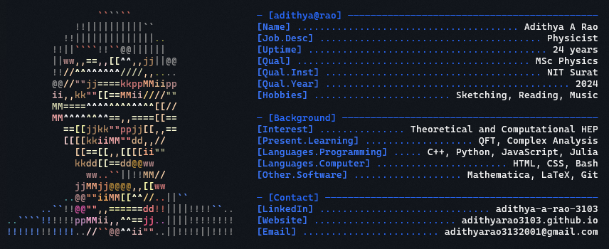

<!---
adithyarao3103/adithyarao3103 is a ✨ special ✨ repository because its `README.md` (this file) appears on your GitHub profile.
You can click the Preview link to take a look at your changes.
--->
<!-- # Hi, I’m Adithya

- I am a physicist with an interest in theoretical and computational physics
- My field of research so far has been theoretical and computational studies of quantum field theories.
- I’m currently learning **Julia, ROOT, Deep Learning, and Quantum Computing**
- Take a look at my profile at https://adithyarao3103.github.io/ -->

[Good programmers steal stuff](https://github.com/Andrew6rant)

---

## $\color{#fadfd5}{\text{My philosophy of progress-}}$

$\color{gray}{\text{Slowly progressing from}}$ $\color{gray}{
\text{'How do spinor fields interact with the gauge fields?' \\
to}}$ $\color{gray}{\text{'What the heck is a spinor?'}}$

---
<!-- 
## $\color{#fadfd5}{\text{Showcase-}}$

 -->

<!-- --- -->

<!-- ## Most Used Languages

--- -->
<!-- 
## Activity

--- -->

<!--  -->

<!-- --- -->
<!-- 

## Socials

  -->

<!-- ## Tech Stack:

 
 
 
 
 
 
 
 
 

 -->

<!-- --- -->
<!--  -->
<!--  -->
<!--  -->

<!-- Proudly created with GPRM ( https://gprm.itsvg.in ) -->

<!-- ---

## $\color{#fadfd5}{\text{Stats-}}$

 -->
